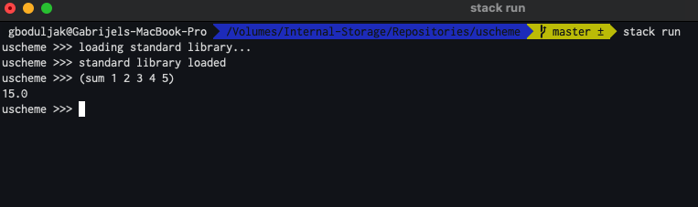

# μscheme


## Intro

**μscheme** (micro Scheme) is a toy interpreter for the Scheme programming language, implementing a relatively (large) subset of [R5RS](https://schemers.org/Documents/Standards/R5RS/) language specification. The interpreter comes with an integrated REPL shell.
The implementation of the interpreter is based on the book [Write Yourself a Scheme in 48 Hours](https://en.wikibooks.org/wiki/Write_Yourself_a_Scheme_in_48_Hours) and a series of blog posts [Write Yourself a Scheme, Version 2.0]([https://wespiser.com/writings/wyas/00_overview.html]). Test cases used in unit tests are taken from [Berkeley's Structure and Interpretation of Computer Programs course](https://inst.eecs.berkeley.edu/~cs61a/sp20/). 

However, this implementation differs significantly from both resources mentioned above. The most important differences are in the implementation of lexical scoping and the structure of evaluator.

### Supported Scheme features
- arithmetic and list processing
- majority of language primitives for processing lists and strings (e.g **car**, **cdr**, **cons** and friends)
- lexical scoping using **let**, **define** and **set**
- **lambda** functions and **named procedures** (recursion supported)
- conditionals using **if** and **cond**
- sequential execution using **begin**
- displaying (printing) using **display**
- loading source code from files into the shell using **load**

Again, it is worth noting this is by no means complete implementation of [R5RS](https://schemers.org/Documents/Standards/R5RS/) language specification, but 'small enough' programs should work. 

For examples of 'small enough' supported programs, see the section **A few examples**.

For more information about testing, see Tests section.

For instructions to setup and run the interpreter with REPL, see Build & Run section.
### Partial bootstrapping
The interpreter  comes with an implementation of a subset of Scheme standard library, written in Scheme. The implementation is taken from [Write Yourself a Scheme in 48 Hours](https://en.wikibooks.org/wiki/Write_Yourself_a_Scheme_in_48_Hours). When the REPL is loaded, the above mentioned standard library is loaded into the shell and is ready for usage.

### A few examples
For a better overview, all language features required to interpret the following two programs are supported.

> Computation of **ackermann function**
```scheme
(define ackermann (
    lambda (m n) (
        if (= m 0)
            (+ n 1)
            (if (= n 0)
                (ackermann (- m 1) 1)
                (ackermann (- m 1) (ackermann m (- n 1))))
    )
))
(ackermann 1 2)
(ackermann 3 3)
```

> Peter Norvig's **riff-shuffle**
```scheme
(define (combine f)
  (lambda (x y)
    (if (null? x) nil
      (f (list (car x) (car y))
         ((combine f) (cdr x) (cdr y))))))
(define zip (combine cons))

(define riff-shuffle (lambda (deck) (begin
    (define take (lambda (n seq) (if (<= n 0) (quote ()) (cons (car seq) (take (- n 1) (cdr seq))))))
    (define drop (lambda (n seq) (if (<= n 0) seq (drop (- n 1) (cdr seq)))))
    (define mid (lambda (seq) (/ (length seq) 2)))
    ((combine append) (take (mid deck) deck) (drop (mid deck) deck)))))

(riff-shuffle (list 1 2 3 4 5 6 7 8))
```


### Currently not supported Scheme features
- **let***, **letrec** and friends
- full numeric tower
- explicit tail recursion optimisation
- hygienic macros :(

## Architecture

### Lexical and syntactic analysis

parser combinators


### Semantic analysis
Absent, merged with Evaluation stage .
### Lexical scoping 
The implementation of lexical scoping is based on the scope resolver with a symbol table, which differs from 'ad hoc' solutions using  **IO monad** with handles or a **Reader** monad presented in the resources mentioned. The main reason for an approach of using a custom scope resolver monad and a symbol table is the separation of concerns and expressivity, which result in a more faithful and testable implementation of lexical scoping. 
-  Everything related to scoping is in src/Scoping

The competing solution of using **IO monad** is probably more convenient, but violates separation of concerns and is not considered a good practice. The competing solution of using the **Reader** monad is harder to test and even possibly incorrect. 

> Scope
```haskell
data Scope = Scope
  { id :: ScopeId,
    parentId :: Maybe ScopeId,
    symbolTable :: Map String LispVal
  }
  deriving (Show)

extend :: Scope -> Binding -> Scope
extend scope (name, value) =
  Scope
    { id = id scope,
      parentId = parentId scope,
      symbolTable = Map.insert name value (symbolTable scope)
    }

lookup :: Scope -> String -> Maybe LispVal
lookup Scope {symbolTable} name = Map.lookup name symbolTable
```

> Scope Resolver
```haskell
data ScopeContext = ScopeContext
  { scopes :: Map ScopeId Scope,
    currentScopeId :: ScopeId
  }
  deriving (Show)

type ScopeResolver a = StateT ScopeContext IO a
```


```haskell

extend :: Binding -> ScopeResolver Scope
extend binding =
  do
    scope <- current
    scopes <- gets scopes
    let scope' = Scope.extend scope binding
     in do
          put
            ScopeContext
              { currentScopeId = id scope,
                scopes = Map.insert (id scope) scope' scopes
              }
          current

lookup :: String -> ScopeResolver (Maybe LispVal)
lookup name = do
  currentScopeId <- gets currentScopeId
  match <- lookupIn currentScopeId name
  case match of
    (Just (value, scope)) -> return (Just value)
    Nothing -> return Nothing
```


### Evaluation

```haskell
type EvalMonad a = ExceptT LispError (StateT ScopeContext IO) a
```


```haskell
applyPrimitive :: LispVal -> [LispVal] -> EvalMonad LispVal
applyPrimitive PrimitiveFunction {name} evaledArgs = do
  case lookup name of
    (Just funcBody) -> do funcBody evaledArgs
    Nothing -> throwError (NotFunction "unrecognised primitive function: " name)
```

### Testing

Test cases based on berkeley, little schemer and SICP

## Build & Run

To build & run this project, you will need a [Haskell Stack](https://docs.haskellstack.org/en/stable/README/).
The following sequence of commands should setup the project:
- clone the project
- run ```stack install``` in the root folder
- run ```stack build``` in the root folder

To start the interpreter, run ```stack run``` in the root folder.
You should see:




To load scheme source files into the REPL, use ``(load "{path to source file}")``.

To exit REPL type ```(quit)```.

### Possible improvements
- Enhance lexer and parser error description (not too difficult)
- Implement unsupported language features (quite tricky, especially macros)
- Support for multiline input in REPL (quite tricky)